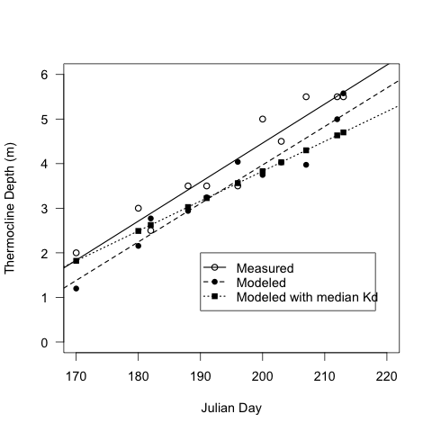

# Comparison of the measured TD, the predicted TD from the Kd, Julian, Area Model, and the predicted TD using the median KD in the model.

## Introduction

These code are mainly to redraw figure 8 for the boondoggle ms.  I am adding the predicted TD if the median Kd is used in the model

### Load data

    getwd()
    [1] "/Volumes/NO NAME/working_files/current_research/boondoggle/inland_waters_submission/revisions/revision_analysis"

    load("./data/boondoggle")
    load("./data/GTH91.case.ms")

### Re-Create model parameters

    summary(lm(TD ~ Kd + Julian + Area, data = boon.tot))

#### Output

~~~~

>     summary(lm(TD ~ Kd + Julian + Area, data = boon.tot))

Call:
lm(formula = TD ~ Kd + Julian + Area, data = boon.tot)

Residuals:
     Min       1Q   Median       3Q      Max 
-2.39035 -0.59246  0.00431  0.46310  2.03108 

Coefficients:
             Estimate Std. Error t value Pr(>|t|)    
(Intercept) -7.081766   3.219839  -2.199 0.033544 *  
Kd          -3.084772   0.874888  -3.526 0.001054 ** 
Julian       0.067080   0.013833   4.849 1.82e-05 ***
Area         0.037501   0.009969   3.762 0.000529 ***
---
Signif. codes:  0 ‘***’ 0.001 ‘**’ 0.01 ‘*’ 0.05 ‘.’ 0.1 ‘ ’ 1 

Residual standard error: 0.9267 on 41 degrees of freedom
  (2 observations deleted due to missingness)
Multiple R-squared: 0.7214,	Adjusted R-squared: 0.7011 
F-statistic:  35.4 on 3 and 41 DF,  p-value: 1.862e-11

~~~~

### Generate predicted TD from Kd and from median Kd

    predTD.medianKd <- (median(GTH91.case.ms$Kd) * -3.08) + (GTH91.case.ms$Julian * 0.067) + (GTH91.case.ms$Area * 0.04) - 7.08

#### Output

    > predTD.medianKd
    [1] 1.820028 2.490028 3.026028 3.830028 4.299028 4.701028 2.624028 3.227028
    [9] 3.562028 4.031028 4.634028

### Plot of TD, predicted TD, and predicted TD using the median Kd by Julian Day

    
    par(las = 1, cex = 1.2)
    plot(TD ~ Julian, data = GTH91.case.ms, ylim = c(0, 6), xlim = c(170, 220), xlab = "Julian Day", ylab = "Thermocline Depth (m)", lwd = 1.5)
    points(pred.TD ~ Julian, data = GTH91.case.ms, pch = 16)
    points(predTD.medianKd ~ Julian, data = GTH91.case.ms, pch = 15)
    abline(lm(TD ~ Julian, data = GTH91.case.ms), lwd = 1.5)
    abline(lm(pred.TD ~ Julian, data = GTH91.case.ms), lty = 2, lwd = 1.5)
    abline(lm(predTD.medianKd ~ Julian, data = GTH91.case.ms), lty = 3, lwd = 1.5)
    legend(190, 2, c("Measured", "Modeled", "Modeled with median Kd"), pch = c(1, 16, 15), lty = c(1, 2, 3), lwd = 1.5)
    dev.copy(jpeg, "./output/TD_by_Julian.jpg")
    dev.off()
    dev.copy(pdf, "./output/TD_by_Julian.pdf")
    dev.off()
    dev.copy(png, "./output/TD_by_Julian.png")
    dev.off()

